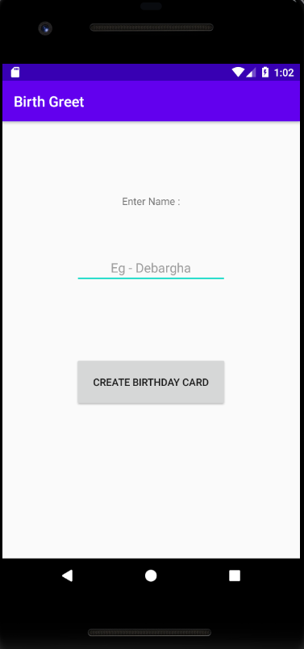
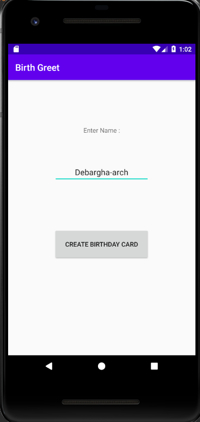

# BirthdayGreetings
### Created a  basic android application to wish your close one's on their Birthday(To be deployed soon on Google Play Store)

<b>How it works ?</b>

1. Open the application Birthday Greetings on your phone.

 
2. Enter the name of the person you want to wish and tap on "<b>CREATE BIRTHDAY WISH</b>".

 
3. A message pops up on the bottom showing the name and control moves to a new page.

 
4. Here you go...send the wish

